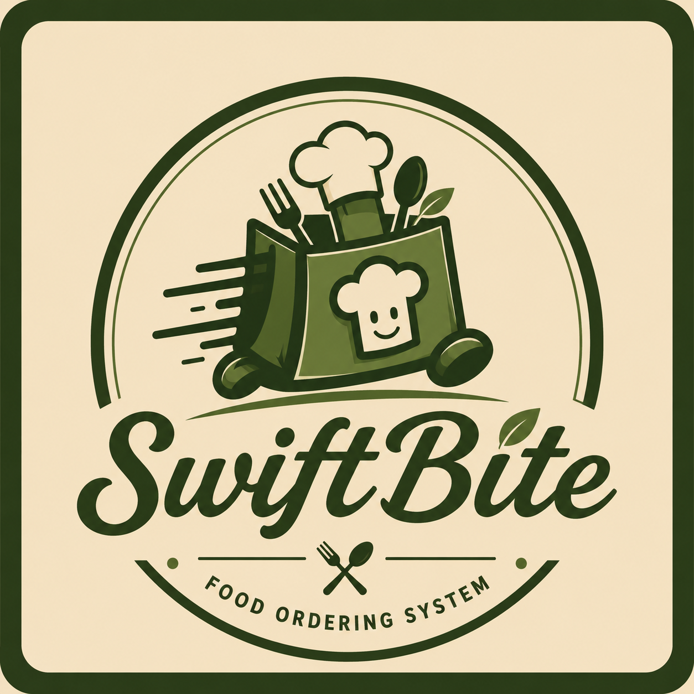

<div align="center">
  
  <h1>🍔 SwiftBite</h1>
  <p><strong>The modern, lightning-fast food delivery experience—powered by AI.</strong></p>
  
  [](https://swiftbite-ryf2.onrender.com)
</div>

<br />

Welcome to **SwiftBite**, a premium food delivery platform designed to seamlessly bridge the gap between a stunning web marketing presence and a lightning-fast Progressive Web App (PWA) mobile experience.

---

## 🤖 Meet Your AI Food Assistant

What truly sets SwiftBite apart is our deeply integrated **AI Chatbot**. We've moved beyond traditional scrolling and searching by introducing an intelligent, conversational agent designed to make ordering effortless.

**With the SwiftBite AI Chatbot, you can:**
- 🧠 **Get Personalized Recommendations**: Simply type *"I want something spicy and under $15"* and the AI will instantly curate a list of dishes matching your exact cravings.
- 💬 **Order via Conversation**: Build your cart naturally through chat. *"Add two smash burgers and a side of truffle fries."*
- ⏱️ **Real-time Order Tracking**: Ask the chatbot *"Where is my order?"* for instant, up-to-the-minute updates on your delivery partner's location.
- 🥗 **Dietary Intelligence**: The AI automatically filters out allergens and adheres to your specific dietary requirements (e.g., Vegan, Gluten-Free) by understanding your profile.

---

## ✨ Key Features

- **Premium Web Landing Page**: A visually stunning, desktop-first landing page with modern glassmorphism, micro-animations, and vibrant culinary aesthetics.
- **Mobile-First PWA Core**: Once users click "Let's Get Started", the app seamlessly transitions into a highly responsive, app-like mobile view.
- **Interactive UI/UX**: Includes a dynamic cart system, favorite restaurant tracking, category filtering, and real-time order history.
- **Three-Tier Portals**: Built-in support for Customer, Admin, Delivery Partner, and Restaurant Owner portals.

## 🛠️ Tech Stack

- **Frontend Framework**: React 19 + Vite
- **Styling**: Tailwind CSS + Custom CSS Variables
- **Type Safety**: TypeScript
- **Deployment**: Vercel / Render *(update as needed)*

## 🚀 Getting Started

To run the SwiftBite frontend locally on your machine:

1. **Clone the repository**
   ```bash
   git clone https://github.com/yourusername/SwiftBite.git
   cd SwiftBite
   ```

2. **Navigate to the frontend**
   ```bash
   cd frontend
   ```

3. **Install dependencies**
   ```bash
   npm install
   ```

4. **Start the development server**
   ```bash
   npm run dev
   ```
   *The app will instantly launch on your local host with the premium web landing page!*

---
<div align="center">
  <i>Built with ❤️ for food lovers everywhere.</i>
</div>